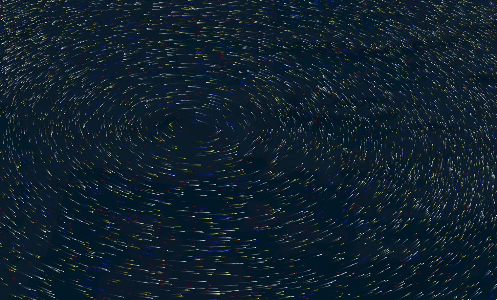
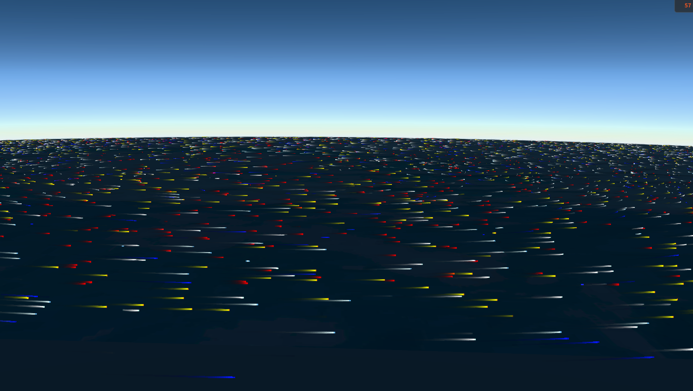
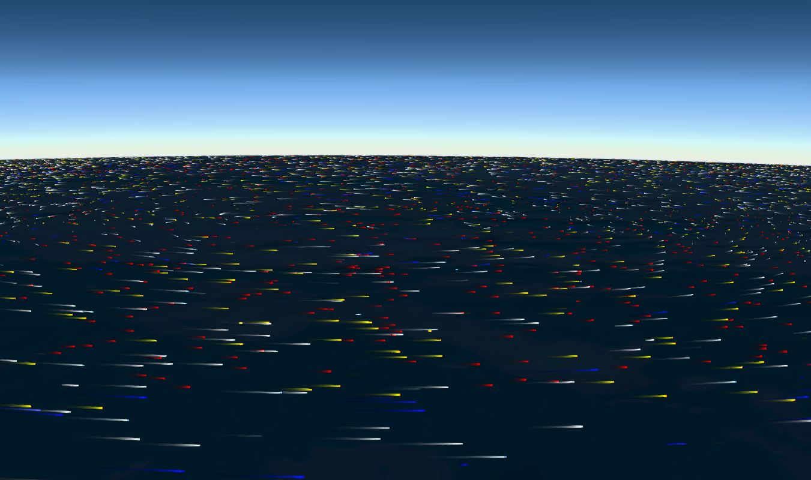
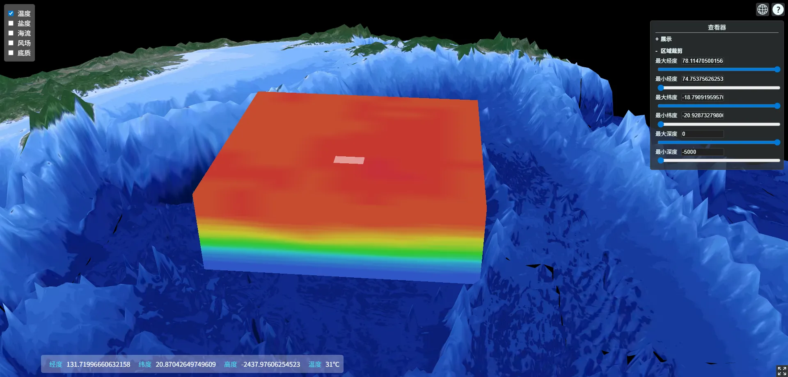

# oceanEnv
基于Cesium + shader 编程实现的三维流体渲染，真实模拟海洋洋流、低空风等流动动画以及海洋海水三维体渲染效果。

### 读取NC文件  需要包含以下参数
defaultFields = {
  U: 'U', // 横向速度
  V: 'V', // 纵向速度
  W: '', // 垂直速度
  H: '', // 高度属性
  lon: 'lon', // 经度
  lat: 'lat', // 纬度
  lev: '', // 层
}

### 设置粒子状态
  maxParticles: 64 * 64, // 最大粒子数(会自动取平方数)
  particleHeight: 1000.0, // 粒子高度
  fadeOpacity: 0.996, // 拖尾透明度
  dropRate: 0.003, // 粒子重置率
  dropRateBump: 0.01, // 随速度增加的粒子重置率百分比，速度越快越密集，
                      // 最终的粒子重置率particleDropRate = dropRate + dropRateBump * speedNorm;
  speedFactor: 1.0, // 粒子速度
  lineWidth: 4.0, // 线宽
  dynamic: true // 是否动态运行

  版本支持webgl2

### 具体效果查看 流体、温度体渲染截图

